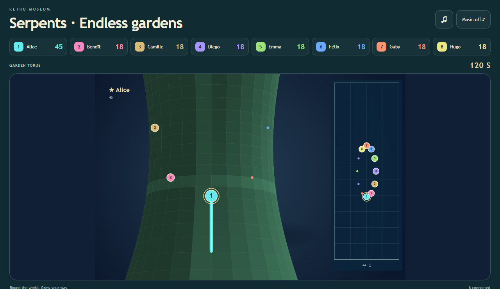
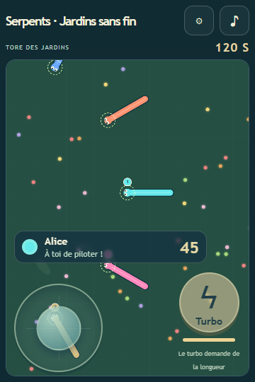

# Serpents · Endless gardens

1–8 players, plus 0/2/4 automatic opponents. A standalone Retro Museum game with a shared screen and phone joysticks.

[Play online](https://play.retro-museum.net/g/serpents) · [Collection](https://retro-museum.net/#catalog)



## Play

Smooth steering, glowing seeds, body collisions, respawns and length-consuming boost. The largest human serpent at timeout wins; automatic opponents never occupy the human podium. Hitting your own body also causes death and the normal respawn. Only the short neck immediately behind the head is excluded so ordinary turns remain safe. The square 3600×3600 world wraps in both axes: there are no lethal edges. The display projects that topology onto a 3D torus and follows the largest living serpent like a drone, with smoothly varying altitude and a trailing camera. An exact distance check keeps the camera outside the solid torus, including its inner hole; near-plane clipping prevents broken geometry at close range. A large portrait overview map remains visible. Its height-to-width ratio follows the torus major/minor radii (2.35 / 0.86): the major circumference runs vertically, the minor circumference horizontally. The underlying square game coordinates are unchanged. Humans use their host avatars (numbered colour fallback); automatic opponents are small dots. Each phone follows its own snake with translucent joystick and boost controls over the view.

Open the game on the shared screen, scan its QR code on each phone, and start from the organiser controls. On a phone, use the gear button to choose **Joystick** or **Touch to steer**. Drag the joystick disc, or touch and slide anywhere on the scene to steer toward your finger. The head rotates locally at a bounded turn rate. Hold the separate boost button to accelerate; it works with a second finger while steering. Releasing the steering finger leaves the snake moving in its last direction. The chosen mode stays selected through state, language and match changes in the open game frame; session storage also retains it where the browser sandbox permits storage. Keyboard alternatives: arrows/WASD and Space to boost.

Head, body and camera movement interpolate locally between network updates. No additional steering or state messages are sent for the extra animation frames.

English, French and Tagalog are included. The organiser chooses the display language, each player chooses their phone language. Sound and optional music have mute controls; click the sound button to unlock browser audio. Reduced-motion preferences suppress ambient animation and moving camera angles. Gameplay camera tracking still follows movement.



Joining during a match means spectating until the next replay. **Play again** includes connected waiting spectators up to eight human players. Disconnecting releases boost within 300 ms and never pauses the whole group. The character continues moving under the normal rules. Profiles, invitation sharing, permanent join QR codes and local/offline hosting come from the Retro Museum host.

## Local development

Requires Node.js 22+.

```sh
npm ci --ignore-scripts
npm run build
npm start
```

Open the printed host URL. Phones must be able to reach this host over the local network. The reviewed portable package `dist/game.rmg.json` can be installed from the Retro Museum library.

```sh
npm test
npx playwright install chromium
npm run test:browser
npx retro-museum-validate .
```

[Testing evidence and limits](docs/TESTING.md). The pinned official SDK GitHub Action prevalidates each push.

## Provenance

Original procedural Canvas perspective torus, garden art and synthesized sounds. Not connected to slither.io and contains no third-party game assets. The torus is a visualization of the square wrapped game coordinates, not a geodesic physics simulation. Common controller, host bridge and rendering helpers share an original implementation with Manaty's related arcade games; each repository and portable package is independently runnable. No advertising, tracking, purchases, cash prizes or external game services. MIT · Manaty.
